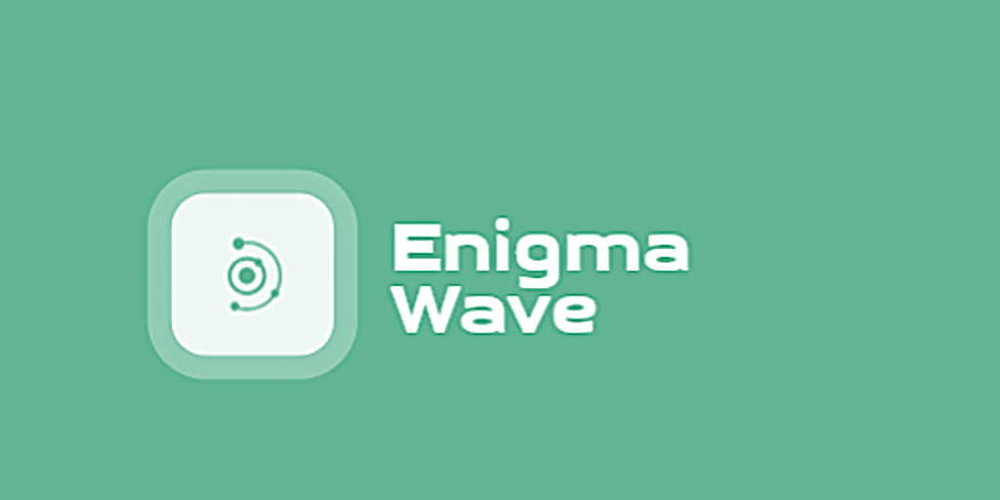

<!--  -->

# Enigma Wave OS
Enigma Wave - это небольшая операционная система придуманная энтузиастом ***jdose100***.
Она вдохновленна ***Linux*** и ***Windows***. Она использует язык программирования 
[Rust](https://www.rust-lang.org/ru/tools/install) в качестве основного.

> ОЧЕНЬ ВАЖНО! В данный момент систему на реальном оборудовании лучше не использовать, так как она
находится на очень раннем этапе разработки. Автор не дает каких либо гарантий что устройство не будет
поврежденно при использовании данной системы!

## Системные требования
+ <u>***Процессор***</u> - многоядерный процессор с поддержкой UEFI и архитектурой x86-64.
+ <u>***ОЗУ***</u> - Неизвестно, на эмуляторе QEMU идет потребление в 100 мб.
+ <u>***Диск***</u> - Неизвестно, не может работать с дисками из-за отсутсвия драйверов.
+ <u>***Видеокарта***</u> - Неизвестно, возможно не требуется.
+ <u>***Разрешение экрана***</u> - Неизвестно.
+ <u>***Дополнительно***</u> - обязательно поддержка *UEFI*.

## Цели

+ [x] Создание своей ОС для понимания автора, как они работают.
+ [ ] Практически полная настраиваемость.
    + [ ] Возможность заменить любые динамически загружаемые компоненты,
    при удолетворении определенных условий.
    + [ ] Удобный конфиг из коробки, который легко редактировать как через GUI, так
    и через терминал.
+ [ ] Операционная система для геймеров.
    + [ ] Минимальное потребление ресурсов.
    + [ ] Максимальная скорость
    + [ ] Удобный, быстрый и максимально безболезненый переход.
        + [ ] Необычный, но крайне знакомый интерфейс.
        + [ ] Легкое освоение прямо из коробки.
    + [ ] Интеграция со ***Steam***.
        + [ ] Написание своего эмулятора ***Windows*** для ***Steam*** и интеграция его в площадку.
+ [ ] Приемлемая безопастность.
+ [ ] Высокая отказоустойчивость.

## Прогресс
> На данный момен система находится на очень раннем этапе разработки и предстоит ещё много чего реализовать.

+ [ ] Ядро с минимальными возможностями (***enigma-kernel 0.0.1-alpha***)
    + [x] Интеграция с [bootloader](https://crates.io/crates/bootloader)
    + [x] Минимально рабочее ядро
        + [x] Возможность вывода на экран
        + [x] Обработка некоторых исключений и прерываний.
        + [x] Реализация paging.
        + [x] Реализация кучи ядра.
    + [x] Минимально рабочая ассинхроность.
        + [x] Возможность запускать ассинхронный код.
    + [ ] Файловая система (некоторые варианты: fat12, fat32, exfat, ext2)
        + ???
    + [ ] Многопроцессорность (виртуальные процессы)
        + ???
    + [ ] Многопоточность
        + ???
    + [ ] Динамическая загрузка частей ядра
        + ???
---
+ [ ] Ядро с слабой поддержкой 3 кольца (пользовательские приложения, ***enigma-kernel 0.0.2-alpha***)
    + [ ] Возможность запускать приложения без динамический библиотек
    + [ ] Системные вызовы (syscalls)
    + [ ] Рабочий shell.
        + [ ] Некоторые встроенные команды (например cd, ls и т.д)
        + [ ] Запуск программ
        + ???

---
+ Следующие шаги создания ОС
    + ???

# Архитектура

## System ABI
Данная система использует *[System V AMD64 ABI](https://en.wikipedia.org/wiki/X86_calling_conventions#System_V_AMD64_ABI)* 
для архитектуры x86-64 под внешние (пользовательские) приложения.

Данная система использует *[ELF x86-64-ABI psABI](https://gitlab.com/x86-psABIs/x86-64-ABI)* для кода ядра
(относится ли это к загружаемым динамический библиотекам ядра неизвестно на данный момент).

## Каталоги
В [*корневом*](./) каталоге находится сборщик системы, его задача собрать систему в *\*.iso* (сейчас *\*.img* файл) и запустить
эмулятор если потребуется.

В каталоге [*enigma-kernel*](enigma-kernel/) находится ядро системы.

# Лицензия
+ [MIT License](LICENSE) или http://opensource.org/licenses/MIT

# Источники
+ [Создание ОС на Rust от Philipp Oppermann](https://os.phil-opp.com)
+ [Bootloader](https://github.com/rust-osdev/bootloader)
+ [OSDev Wiki](https://wiki.osdev.org/Main_Page)
