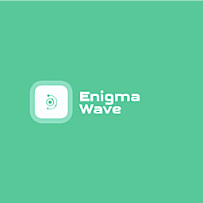

# 
[]

## Enigma Wave OS
Enigma Wave - это небольшая операционная система придуманная энтузиастом `jdose100`.
Она основана на `Linux` 6.x (так-как первоночальный автор является любителем линукс) и
`Windows`. Она использует язык программирования [Rust](https://www.rust-lang.org/ru/tools/install)
в качестве основного.

> ОЧЕНЬ ВАЖНО! В данный момент систему на реальном оборудовании лучше не использовать, так как она
находится на очень раннем этапе разработки. Автор не дает каких либо гарантий что устройство не будет
поврежденно при использовании данной системы!

## Системные требования
- Процессор: многоядерный процессор с поддержкой UEFI и архитектурой x86-64.
- ОЗУ: Неизвестно, на эмуляторе QEMU идет потребление в 100м.
- Диск: Неизвестно, не может работать с дисками из-за отсутсвия драйверов.
- Видеокарта: Неизвестно, возможно не требуется.
- Разрешение: Неизвестно.
- Дополнительно: обязательно поддержка UEFI.

## Цели
Целью данной системы является создание новой Unix-подобной системы со своими изюминками,
такими как удобный Syscall API (как раз основано на большом win32 api), необычный внешний
вид в стандартном оконном менеджере (в виде tui интерфейса, например `Ly`), высокая 
кастомизированность системы (возможность заменить динамически загружаемые системные библиотеки,
внешний оконный менеджер и т.д), возможность использовать данную ОС как угодно (благодоря MIT лицензии).

## System ABI
Данная система использует `System V ABI` для архитектуры x86-64 для внешних (пользовательских) приложений.

Данная система использует (ELF x86-64-ABI psABI)[https://gitlab.com/x86-psABIs/x86-64-ABI] для кода ядра
(относится ли это к загружаемым динамический библиотекам ядра неизвестно на данный момент).

## Отличие от Linux
Этот пунк важен, так как Linux ядро распространяется под лицензией `GPL-2.0`. В случае замечания нарушения
лицензии в исходном коде просьба немедленно сообщать об этом автора (на данный момент `jdose100`). В этом
пункте объясняется то, что может быть связанно с ядром Linux и используется в исходном коде, но 
(судя по открытым источникам) не попадает под лицензию `GPL-2.0`. А именно:

- System ABI
- ELF64

Также задача системы иметь полную совместимость с не графическими приложениями написанными для Linux, КОТОРЫЕ
не использую напрямую системные вызовы и взаимодействие с ядром в том, или ином виде, используют кроссплатформенные 
абстракции стандартной библиотеки языка Си начиная от стандарта `C11`.

## Прогресс
> На данный момен система находится на очень раннем этапе разработки и предстоит ещё много чего реализовать.

- [ ] Ядро с минимальными возможностями (`enigma-kernel 0.0.1-alpha`)
    - [x] Интеграция с [bootloader](https://crates.io/crates/bootloader)
    - [x] Минимально рабочее ядро
        - [x] Возможность вывода на экран
        - [x] Обработка некоторых исключений и прерываний.
        - [x] Реализация paging.
        - [x] Реализация кучи ядра.
    - [x] Минимально рабочая ассинхроность.
        - [x] Возможность запускать ассинхронный код.
    - [ ] Файловая система (некоторые варианты: fat12, fat32, exfat, ext2)
        - ???
    - [ ] Многопроцессорность (виртуальные процессы)
        - ???
    - [ ] Многопоточность
        - ???
    - [ ] Динамическая загрузка частей ядра
        - ???

- [ ] Ядро с слабой поддержкой 3 кольца (пользовательские приложения, `enigma-kernel 0.0.2-alpha`)
    - [ ] Возможность запускать приложения без динамический библиотек
    - [ ] Системные вызовы (syscalls)
    - [ ] Рабочий shell.
        - [ ] Некоторые встроенные команды (например cd, ls и т.д)
        - [ ] Запуск программ
        - ???
- Следующие шаги создания ОС
    - ???

## Лицензия
- MIT License ( или http://opensource.org/licenses/MIT)

## Источники
[Создание ОС на Rust от Phil Opp](https://os.phil-opp.com/vga-text-mode/)

[bootloader](https://github.com/rust-osdev/bootloader)

[OSDEV.org](https://wiki.osdev.org/Main_Page)

